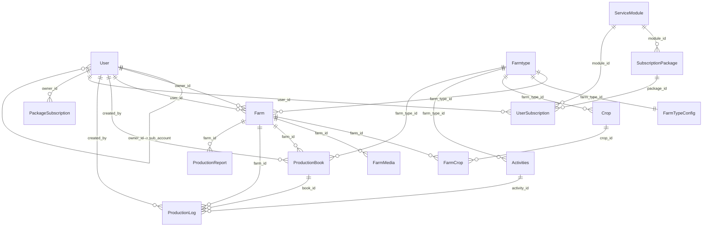

# Tai lieu Database va Model - DiaryTechBE

## 1. Muc dich tai lieu
Tai lieu nay tong hop toan bo model hien co trong `src/models` de ban co the nhanh chong nam:

- Moi model dung de lam gi
- Model co nhung truong nao
- Truong nao bat buoc, mac dinh, enum, index
- Model lien ket voi model nao
- Luong nghiep vu nao dang su dung model do
- Nhung diem can luu y vi schema va controller hien tai chua hoan toan dong bo

Luu y:

- Tai lieu nay duoc viet dua tren schema Mongoose va cach controller dang su dung thuc te trong codebase hien tai.
- Day la he thong MongoDB dung Mongoose, nen "quan he" o day la quan he qua `ObjectId ref`, populate, hoac quan he nghiep vu.
- Mot so model co dau hieu la model cu/du phong chua duoc dung trong route-controller hien tai. Phan do se duoc ghi ro trong muc ghi chu.

## 2. Tong quan nhom du lieu
He thong hien tai co the chia thanh 5 nhom du lieu lon:

1. Nguoi dung va phan quyen
   - `User`

2. Nong trai va cau hinh nong trai
   - `Farmtype`
   - `FarmTypeConfig`
   - `Farm`
   - `Crop`
   - `FarmCrop`
   - `FarmMedia`

3. Hoat dong va nhat ky san xuat
   - `Activities`
   - `ProductionBook`
   - `ProductionLog`
   - `ProductionReport`

4. Subscription / SaaS module
   - `ServiceModule`
   - `SubscriptionPackage`
   - `UserSubscription`
   - `PackageSubscription`

5. Du lieu long trong document
   - `province`, `ward` trong `Farm`
   - `sections`, `fields`, `columns` trong `FarmTypeConfig`
   - `fields` trong `Activities`
   - `general_info` trong `ProductionBook`
   - `data` trong `ProductionLog`

## 3. So do quan he tong quan



## 4. Chi tiet tung model

### 4.1. `User`
File: `src/models/User.model.ts`

#### Muc dich
Model trung tam cho tai khoan he thong. Model nay dung cho tat ca vai tro:

- `superadmin`
- `admin`
- `owner`
- `sub_account`

Trong nghiep vu hien tai:

- `owner` la chu tai khoan chinh
- `sub_account` la tai khoan con, thuong duoc tao cung luc tao `Farm`
- `owner_id` dung de noi `sub_account` ve `owner`

#### Truong du lieu

| Truong | Kieu | Bat buoc | Mac dinh | Ghi chu |
|---|---|---:|---|---|
| `phone` | `String` | Co | - | So dien thoai dang nhap, unique |
| `password` | `String` | Co | - | Duoc hash bang `bcrypt` truoc khi save |
| `name` | `String` | Co | - | Ten nguoi dung |
| `address` | `String` | Khong | - | Dia chi |
| `des` | `String` | Khong | `''` | Mo ta ngan |
| `avatar` | `String` | Khong | `''` | Anh dai dien |
| `gender` | `Number` | Khong | `1` | Code gioi tinh, comment trong code ghi `1 = Female`, khac `1` thi xem nhu Male |
| `role` | `String` | Co | `'owner'` | Enum: `superadmin`, `admin`, `owner`, `sub_account` |
| `owner_id` | `ObjectId` | Khong | - | Ref `User`, dung cho `sub_account` |
| `status` | `String` | Khong | `'active'` | Enum: `active`, `inactive`, `suspended` |
| `last_login` | `Date` | Khong | `Date.now` | Lan dang nhap gan nhat |
| `created_at` | `Date` | Khong | `Date.now` | Ngay tao |
| `updated_at` | `Date` | Khong | `Date.now` | Ngay cap nhat |

#### Method

| Method | Muc dich |
|---|---|
| `comparePassword(password)` | So sanh password plaintext voi password da hash |

#### Middleware / Logic dac biet

- `pre('save')`: neu `password` bi thay doi thi hash lai bang `bcrypt`

#### Index

| Index | Muc dich |
|---|---|
| `{ phone: 1 }` unique | Bao dam duy nhat va tim dang nhap nhanh |
| `{ owner_id: 1 }` | Tim danh sach sub-account theo owner |
| `{ role: 1 }` | Loc theo vai tro |
| `{ status: 1 }` | Loc theo trang thai |
| `{ created_at: -1 }` | Sap xep moi nhat truoc |

#### Quan he

- Tu tham chieu voi chinh `User`
  - `owner (User)` 1 - n `sub_account (User)`
- `User` 1 - n `Farm`
  - qua `owner_id`
- `User` 1 - n `Farm`
  - qua `user_id` (tai khoan van hanh farm)
- `User` 1 - n `ProductionBook`
  - qua `created_by`
- `User` 1 - n `ProductionLog`
  - qua `created_by`
- `User` 1 - n `UserSubscription`
  - qua `user_id`
- `User` 1 - n `PackageSubscription`
  - qua `owner_id`

#### Duoc su dung o dau

- Dang ky / dang nhap / lay profile: `src/controllers/auth.controller.ts`
- Lay farmer theo owner: `src/controllers/owner.controller.ts`
- Cap nhat profile: `src/controllers/user.controller.ts`
- Tao sub-account khi tao farm: `src/controllers/farm.controller.ts`

#### Ghi chu quan trong

- `updated_at` khong tu dong cap nhat vi schema khong dung `timestamps: true` va controller cung khong cap nhat nhat quan.
- `updateUser` dang cap nhat `updatedAt`, trong khi schema la `updated_at`. Dieu nay de lai kha nang du lieu bi lech field.

---

### 4.2. `ServiceModule`
File: `src/models/ServiceModule.model.ts`

#### Muc dich
Danh sach module dich vu co the ban theo kieu SaaS. Vi du:

- `farm_diary`
- `agri_map`
- `trace_origin`

No la lop "module goc", sau do moi module co the co nhieu `SubscriptionPackage`.

#### Truong du lieu

| Truong | Kieu | Bat buoc | Mac dinh | Ghi chu |
|---|---|---:|---|---|
| `key` | `String` | Co | - | Ma module, unique |
| `name` | `String` | Co | - | Ten hien thi |
| `description` | `String` | Khong | - | Mo ta module |
| `is_active` | `Boolean` | Khong | `true` | Bat/tat module |

#### Index

| Index | Muc dich |
|---|---|
| `{ key: 1 }` unique | Dinh danh module |
| `{ is_active: 1 }` | Loc module dang hoat dong |

#### Quan he

- `ServiceModule` 1 - n `SubscriptionPackage`
- `ServiceModule` 1 - n `UserSubscription`

#### Duoc su dung o dau

- Tao module dich vu: `src/controllers/serviceModule.controller.ts`
- Kiem tra module khi tao goi: `src/controllers/subscriptionPackage.controller.ts`
- Kiem tra module khi tao user subscription: `src/controllers/userSubscription.controller.ts`
- Populate profile user: `src/controllers/auth.controller.ts`

#### Ghi chu quan trong

- Controller `getAllServiceModules` dang sort theo `createdAt`, trong khi schema khong bat `timestamps`. Nghia la field nay co the khong ton tai trong document.

---

### 4.3. `SubscriptionPackage`
File: `src/models/SubscriptionPackage.model.ts`

#### Muc dich
Dinh nghia tung goi cu the ben trong moi `ServiceModule`.
Vi du cung la module "Nhat ky dien tu" nhung co the co cac goi:

- Basic
- Pro
- Enterprise

#### Truong du lieu

| Truong | Kieu | Bat buoc | Mac dinh | Ghi chu |
|---|---|---:|---|---|
| `module_id` | `ObjectId` | Co | - | Ref `ServiceModule` |
| `name` | `String` | Co | - | Ten goi |
| `max_sub_accounts` | `Number` | Khong | `1` | So sub-account toi da |
| `price_per_month` | `Number` | Co | - | Gia theo thang |
| `duration_in_days` | `Number` | Co | - | So ngay hieu luc |
| `description` | `String` | Khong | - | Mo ta goi |

#### Index

| Index | Muc dich |
|---|---|
| `{ module_id: 1 }` | Tim goi theo module |
| `{ name: 1 }` | Tim theo ten goi |
| `{ price_per_month: 1 }` | Loc/sap xep gia |
| `{ duration_in_days: 1 }` | Loc theo chu ky |

#### Quan he

- n - 1 voi `ServiceModule`
- 1 - n voi `UserSubscription`

#### Duoc su dung o dau

- Tao goi dich vu: `src/controllers/subscriptionPackage.controller.ts`
- Kiem tra package khi cap subscription cho user: `src/controllers/userSubscription.controller.ts`
- Populate profile user: `src/controllers/auth.controller.ts`

#### Ghi chu quan trong

- Chua co unique constraint de chan trung `name` trong cung mot `module_id`.
- Controller `getAllSubscriptionPackage` cung sort theo `createdAt`, nhung schema khong bat timestamps.

---

### 4.4. `UserSubscription`
File: `src/models/UserSubscription.model.ts`

#### Muc dich
Luu thong tin user dang thue goi nao, thuoc module nao, thoi han bao lau va con bao nhieu sub-account duoc phep tao.

Day la model subscription dang duoc su dung thuc te trong login/profile va cap goi cho user.

#### Truong du lieu

| Truong | Kieu | Bat buoc | Mac dinh | Ghi chu |
|---|---|---:|---|---|
| `user_id` | `ObjectId` | Co | - | Ref `User` |
| `module_id` | `ObjectId` | Co | - | Ref `ServiceModule` |
| `package_id` | `ObjectId` | Co | - | Ref `SubscriptionPackage` |
| `start_date` | `Date` | Khong | `Date.now` | Ngay bat dau |
| `end_date` | `Date` | Co | - | Ngay het han |
| `status` | `String` | Khong | `'active'` | Enum: `active`, `expired`, `pending` |
| `remaining_sub_accounts` | `Number` | Khong | `0` | So sub-account con lai |

#### Index

| Index | Muc dich |
|---|---|
| `{ user_id: 1 }` | Tim subscription theo user |
| `{ module_id: 1 }` | Tim theo module |
| `{ package_id: 1 }` | Tim theo package |
| `{ status: 1 }` | Loc theo trang thai |
| `{ end_date: -1 }` | Tim goi sap het han |
| `{ user_id: 1, module_id: 1 }` | Tim subscription user theo module |

#### Quan he

- n - 1 voi `User`
- n - 1 voi `ServiceModule`
- n - 1 voi `SubscriptionPackage`

#### Duoc su dung o dau

- Tao subscription cho user: `src/controllers/userSubscription.controller.ts`
- Nap profile kem subscription: `src/controllers/auth.controller.ts`

#### Logic nghiep vu dang co

- Khi tao moi:
  - Xac minh `user_id`
  - Xac minh `module_id`
  - Xac minh `package_id`
  - Tu dong tinh `end_date = start_date + duration_in_days`
  - Gan `remaining_sub_accounts = pkg.max_sub_accounts`

#### Ghi chu quan trong

- Chua co rang buoc chan mot user mua nhieu subscription cung `module_id` trong cung thoi diem.

---

### 4.5. `PackageSubscription`
File: `src/models/PackageSubscription.model.ts`

#### Muc dich
Co ve la mot model cu hoac model du phong cho bai toan owner mua package. Tuy nhien trong code hien tai:

- Khong thay route/controller nao dang dung model nay
- Ref `package_id` tro toi model `'Package'`, trong khi codebase khong co model `Package`

#### Truong du lieu

| Truong | Kieu | Bat buoc | Mac dinh | Ghi chu |
|---|---|---:|---|---|
| `owner_id` | `ObjectId` | Co | - | Ref `User` |
| `package_id` | `ObjectId` | Co | - | Ref `'Package'`, hien dang lech ten model |
| `purchase_date` | `Date` | Co | - | Ngay mua |
| `expiry_date` | `Date` | Co | - | Ngay het han |
| `status` | `String` | Khong | `'active'` | Enum: `active`, `expired`, `cancelled` |
| `sub_accounts_allowed` | `Number` | Co | - | So sub-account duoc cap |
| `sub_accounts_created` | `Number` | Khong | `0` | Da tao bao nhieu sub-account |
| `created_at` | `Date` | Khong | `Date.now` | Ngay tao |
| `updated_at` | `Date` | Khong | `Date.now` | Ngay cap nhat |

#### Index

| Index | Muc dich |
|---|---|
| `{ owner_id: 1 }` | Tim goi theo owner |
| `{ package_id: 1 }` | Tim theo package |
| `{ status: 1 }` | Loc theo trang thai |
| `{ expiry_date: -1 }` | Tim goi sap het han |

#### Quan he

- n - 1 voi `User` qua `owner_id`
- `package_id` hien tai khong tro dung den model ton tai trong he thong

#### Danh gia hien trang

Model nay nen duoc xem la:

- model du phong
- hoac model cu chua duoc xoa

Neu ban tiep tuc dung `UserSubscription` lam mo hinh subscription chinh, thi can xem co nen xoa/doi ten/sua ref cho `PackageSubscription` khong.

---

### 4.6. `Farmtype`
File: `src/models/Farmtype.model.ts`

#### Muc dich
Danh muc loai nong trai/loai san xuat. Vi du:

- Trong trot
- Chan nuoi
- Thuy san

Model nay la diem neo cho nhieu model nghiep vu khac.

#### Truong du lieu

| Truong | Kieu | Bat buoc | Mac dinh | Ghi chu |
|---|---|---:|---|---|
| `type_name` | `String` | Co | - | Ten loai nong trai |
| `image` | `String` | Co | - | Anh dai dien |
| `description` | `String` | Khong | - | Mo ta |
| `created_at` | `Date` | Khong | `Date.now` | Ngay tao |
| `updated_at` | `Date` | Khong | `Date.now` | Ngay cap nhat |

#### Index

| Index | Muc dich |
|---|---|
| `{ type_name: 1 }` | Tim theo ten |
| `{ created_at: -1 }` | Sap xep moi nhat truoc |

#### Quan he

- `Farmtype` 1 - n `Farm`
- `Farmtype` 1 - 1 `FarmTypeConfig`
- `Farmtype` 1 - n `Crop`
- `Farmtype` 1 - n `Activities`
- `Farmtype` 1 - n `ProductionBook`

#### Duoc su dung o dau

- Tao/cap nhat/xem farm type: `src/controllers/farmtype.controller.ts`
- Validate khi tao farm: `src/controllers/farm.controller.ts`

---

### 4.7. `FarmTypeConfig`
File: `src/models/FarmTypeConfig.model.ts`

#### Muc dich
Luu cau hinh dong cho tung `Farmtype`, phuc vu viec render form va bang du lieu tren frontend.

Model nay giup he thong ho tro nhieu loai nong trai voi cau hinh khac nhau ma khong can hard-code UI.

#### Cau truc chinh

| Truong | Kieu | Bat buoc | Mac dinh | Ghi chu |
|---|---|---:|---|---|
| `farm_type_id` | `ObjectId` | Co | - | Ref `Farmtype`, unique |
| `title` | `String` | Khong | - | Tieu de cau hinh |
| `description` | `String` | Khong | - | Mo ta cau hinh |
| `sections` | `Array<Section>` | Khong | `[]` | Danh sach section/table |

#### `Section`

| Truong | Kieu | Bat buoc | Ghi chu |
|---|---|---:|---|
| `key` | `String` | Co | Ma section |
| `name` | `String` | Co | Ten hien thi |
| `type` | `String` | Co | Enum: `section`, `table` |
| `fields` | `Array<Field>` | Khong | Dung cho form thuong |
| `columns` | `Array<TableColumn>` | Khong | Dung cho table |

#### `Field`

| Truong | Kieu | Bat buoc | Ghi chu |
|---|---|---:|---|
| `key` | `String` | Co | Key cua field |
| `label` | `String` | Co | Ten hien thi |
| `type` | `String` | Co | Vi du `text`, `number`, `date`, `select` |
| `required` | `Boolean` | Khong | Mac dinh `false` |
| `options` | `Array<{label, value}>` | Khong | Dung khi `type = select` |

#### `TableColumn`

| Truong | Kieu | Bat buoc | Ghi chu |
|---|---|---:|---|
| `key` | `String` | Co | Key cot |
| `label` | `String` | Co | Ten cot |
| `type` | `String` | Co | Vi du `text`, `number`, `select` |
| `required` | `Boolean` | Khong | Mac dinh `false` |
| `options` | `Array<{label, value}>` | Khong | Dung cho cot select |

#### Timestamps

- Dung `timestamps: true`
- Mongoose se tao:
  - `createdAt`
  - `updatedAt`

#### Quan he

- 1 - 1 voi `Farmtype`

#### Duoc su dung o dau

- Tao config: `src/controllers/farmtypeConfig.controller.ts`
- Lay config theo farm type: `src/controllers/farmtypeConfig.controller.ts`

#### Ghi chu quan trong

- `farm_type_id` dang `unique: true`, nghia la moi `Farmtype` chi co 1 bo config duy nhat.

---

### 4.8. `Crop`
File: `src/models/CropCategories.ts`

#### Muc dich
Danh muc cay trong/vat nuoi/doi tuong san xuat duoc phep gan cho farm. Dung de:

- Gan cay trong chinh cho farm
- Loc farm theo crop tren ban do
- Quan ly danh muc crop theo `Farmtype`

#### Truong du lieu

| Truong | Kieu | Bat buoc | Mac dinh | Ghi chu |
|---|---|---:|---|---|
| `name` | `String` | Co | - | Ten crop |
| `slug` | `String` | Co | - | Unique, dung lam dinh danh mem |
| `farm_type_id` | `ObjectId` | Co | - | Ref `Farmtype` |
| `category` | `String` | Khong | `'fruit'` | Nhom crop, comment goi y `fruit`, `livestock`, `aquaculture` |
| `icon` | `String` | Co | - | Icon hien thi |
| `image` | `String` | Khong | - | Anh minh hoa |
| `color` | `String` | Co | - | Mau hien thi |
| `is_active` | `Boolean` | Khong | `true` | Bat/tat crop |

#### Timestamps

- Co `timestamps: true`
- Tao `createdAt`, `updatedAt`

#### Index

| Index | Muc dich |
|---|---|
| `{ slug: 1 }` unique | Dinh danh duy nhat |
| `{ farm_type_id: 1 }` | Tim crop theo loai farm |

#### Quan he

- n - 1 voi `Farmtype`
- 1 - n voi `FarmCrop`

#### Duoc su dung o dau

- Tao, liet ke, update, soft delete crop: `src/controllers/crop.controller.ts`
- Validate crop khi tao farm: `src/controllers/farm.controller.ts`
- Validate crop khi them crop vao farm: `src/controllers/farmCrop.controller.ts`
- Join tren map: `src/controllers/map.controller.ts`

#### Ghi chu quan trong

- Soft delete dang duoc lam bang `is_active = false`, khong xoa document.

---

### 4.9. `Farm`
File: `src/models/Farm.model.ts`

#### Muc dich
Model trung tam cho mot nong trai/khu san xuat. Moi farm lien voi:

- chu so huu `owner`
- tai khoan van hanh `sub_account`
- loai farm
- vi tri, da giac ban do, dien tich
- tinh/xa

#### Truong du lieu

| Truong | Kieu | Bat buoc | Mac dinh | Ghi chu |
|---|---|---:|---|---|
| `owner_id` | `ObjectId` | Co | - | Ref `User`, chu tai khoan |
| `user_id` | `ObjectId` | Co | - | Ref `User`, tai khoan gan voi farm |
| `farm_name` | `String` | Co | - | Ten nong trai |
| `location` | `String` | Khong | `""` | Mo ta dia diem text |
| `farm_type_id` | `ObjectId` | Co | - | Ref `Farmtype` |
| `polygon.type` | `String` | Khong | - | Enum `Polygon` |
| `polygon.coordinates` | `number[][][]` | Khong | - | Toa do geojson polygon |
| `geo_location` | `Array<Number>` | Khong | - | Toa do phuc vu query map |
| `area` | `Number` | Khong | `0` | Dien tich |
| `unit` | `String` | Khong | `'ha'` | Don vi dien tich |
| `soil_type` | `String` | Khong | - | Loai dat |
| `farm_status` | `String` | Khong | `'active'` | Enum: `active`, `inactive`, `under_maintenance` |
| `description` | `String` | Khong | - | Mo ta farm |
| `avatar` | `String` | Khong | `""` | Anh dai dien |
| `province` | `Province subdocument` | Co | - | Thong tin tinh/thanh |
| `ward` | `Ward subdocument` | Co | - | Thong tin phuong/xa |
| `created_at` | `Date` | Khong | `Date.now` | Ngay tao |
| `updated_at` | `Date` | Khong | `Date.now` | Ngay cap nhat |

#### `Province` subdocument

| Truong | Kieu | Bat buoc | Mac dinh | Ghi chu |
|---|---|---:|---|---|
| `id` | `String` | Khong | - | ID ngoai |
| `province_code` | `String` | Co | - | Ma tinh |
| `name` | `String` | Co | - | Ten tinh |
| `short_name` | `String` | Khong | - | Ten ngan |
| `code` | `String` | Khong | - | Ma khac |
| `place_type` | `String` | Khong | - | Kieu don vi hanh chinh |
| `country` | `String` | Khong | `'VN'` | Quoc gia |
| `created_at` | `String` | Khong | `null` | Metadata |
| `updated_at` | `String` | Khong | `null` | Metadata |

#### `Ward` subdocument

| Truong | Kieu | Bat buoc | Mac dinh | Ghi chu |
|---|---|---:|---|---|
| `id` | `String` | Khong | - | ID ngoai |
| `ward_code` | `String` | Co | - | Ma xa/phuong |
| `name` | `String` | Co | - | Ten xa/phuong |
| `province_code` | `String` | Co | - | Ma tinh |
| `created_at` | `String` | Khong | `null` | Metadata |
| `updated_at` | `String` | Khong | `null` | Metadata |

#### Index

| Index | Muc dich |
|---|---|
| `{ owner_id: 1 }` | Lay farm theo owner |
| `{ user_id: 1 }` | Lay farm theo sub-account |
| `{ farm_type_id: 1 }` | Loc theo loai farm |
| `{ created_at: -1 }` | Sap xep moi nhat |
| `{ farm_status: 1 }` | Loc theo trang thai |
| `{ geo_location: '2dsphere' }` | Query vi tri tren map |
| `{ polygon: '2dsphere' }` | Query polygon tren map |
| `{ owner_id: 1, farm_type_id: 1 }` | Loc farm cua owner theo loai |

#### Quan he

- n - 1 voi `User` qua `owner_id`
- n - 1 voi `User` qua `user_id`
- n - 1 voi `Farmtype`
- 1 - n voi `FarmCrop`
- 1 - n voi `FarmMedia`
- 1 - n voi `ProductionBook`
- 1 - n voi `ProductionLog`
- 1 - n voi `ProductionReport`

#### Duoc su dung o dau

- Tao farm: `src/controllers/farm.controller.ts`
- Lay farm theo owner/user: `src/controllers/farm.controller.ts`
- Them crop vao farm: `src/controllers/farmCrop.controller.ts`
- Them media vao farm: `src/controllers/farmMedia.controller.ts`
- Join map detail/list: `src/controllers/map.controller.ts`
- Lay production book/log/report theo farm

#### Logic nghiep vu dang co

Khi tao farm, controller dang:

1. Validate `crop_id` va `farm_type_id`
2. Tao `sub_account` moi trong `User`
3. Tao `Farm`
4. Tao `FarmCrop` chinh dau tien cho farm

Toan bo duoc bao trong transaction session.

#### Ghi chu quan trong

- Interface ghi `geo_location?: string` nhung schema thuc te la `type: [Number]`.
- Interface gioi han `unit` la `'m2' | 'ha'`, nhung schema khong enum hoa, nghia la DB van co the nhan gia tri khac.

---

### 4.10. `FarmCrop`
File: `src/models/FarmCrop.model.ts`

#### Muc dich
Bang lien ket giua `Farm` va `Crop`, cho phep mot farm co nhieu crop va danh dau crop chinh de hien thi tren map.

#### Truong du lieu

| Truong | Kieu | Bat buoc | Mac dinh | Ghi chu |
|---|---|---:|---|---|
| `farm_id` | `ObjectId` | Co | - | Ref `Farm` |
| `crop_id` | `ObjectId` | Co | - | Ref `Crop` |
| `area` | `Number` | Khong | `0` | Dien tich danh cho crop do |
| `is_primary` | `Boolean` | Khong | `true` | Crop chinh cua farm |

#### Timestamps

- Co `timestamps: true`
- Tao `createdAt`, `updatedAt`

#### Index

| Index | Muc dich |
|---|---|
| `{ farm_id: 1 }` | Tim crop theo farm |
| `{ crop_id: 1 }` | Tim farm theo crop |
| `{ farm_id: 1, crop_id: 1 }` | Tranh query cham va kiem tra cap lien ket |

#### Quan he

- n - 1 voi `Farm`
- n - 1 voi `Crop`

#### Duoc su dung o dau

- Tao ban ghi mac dinh khi tao farm: `src/controllers/farm.controller.ts`
- Them crop moi vao farm: `src/controllers/farmCrop.controller.ts`
- Join du lieu map: `src/controllers/map.controller.ts`

#### Logic nghiep vu dang co

- Neu them crop moi voi `is_primary = true`, controller se set tat ca crop cu cua farm thanh `false` truoc khi tao ban ghi moi.

---

### 4.11. `FarmMedia`
File: `src/models/FarmMedia.ts`

#### Muc dich
Luu danh sach hinh anh/video cua farm.

#### Truong du lieu

| Truong | Kieu | Bat buoc | Mac dinh | Ghi chu |
|---|---|---:|---|---|
| `farm_id` | `ObjectId` | Co | - | Ref `Farm` |
| `type` | `String` | Khong | `'image'` | Enum: `image`, `video` |
| `url` | `String` | Co | - | Link media |
| `is_cover` | `Boolean` | Khong | `false` | Anh/video cover |
| `order` | `Number` | Khong | `0` | Thu tu hien thi |

#### Timestamps

- Co `timestamps: true`
- Tao `createdAt`, `updatedAt`

#### Quan he

- n - 1 voi `Farm`

#### Duoc su dung o dau

- Them media: `src/controllers/farmMedia.controller.ts`
- Lay media: `src/controllers/farmMedia.controller.ts`
- Xoa media: `src/controllers/farmMedia.controller.ts`

---

### 4.12. `Activities`
File: `src/models/Activities.model.ts`

#### Muc dich
Danh muc hoat dong co the ghi nhan trong nhat ky san xuat, theo tung loai nong trai.
Vi du:

- Tuoi nuoc
- Bon phan
- Phun thuoc
- Thu hoach

Moi activity co mot danh sach field dong de frontend render form nhap lieu.

#### Truong du lieu

| Truong | Kieu | Bat buoc | Mac dinh | Ghi chu |
|---|---|---:|---|---|
| `farm_type_id` | `ObjectId` | Co | - | Ref `Farmtype` |
| `activity_name` | `String` | Co | - | Ten hoat dong |
| `image` | `String` | Khong | Cloudinary URL mac dinh | Anh dai dien |
| `description` | `String` | Khong | - | Mo ta |
| `fields` | `Array<Field>` | Khong | `[]` | Danh sach field dong |

#### `fields`

| Truong | Kieu | Bat buoc | Mac dinh | Ghi chu |
|---|---|---:|---|---|
| `field_name` | `String` | Co | - | Ten field |
| `field_type` | `String` | Co | - | Kieu field |
| `is_required` | `Boolean` | Khong | `false` | Co bat buoc khong |
| `options` | `String[]` | Khong | - | Lua chon cho field select |

#### Timestamps

- Co `timestamps: true`
- Tao `createdAt`, `updatedAt`

#### Index

| Index | Muc dich |
|---|---|
| `{ farm_type_id: 1 }` | Tim activity theo loai farm |
| `{ activity_name: 1 }` | Tim theo ten |
| `{ created_at: -1 }` | Du kien sap xep, nhung field nay khong ton tai |
| `{ farm_type_id: 1, created_at: -1 }` | Du kien sap xep theo loai + thoi gian, nhung field khong ton tai |

#### Quan he

- n - 1 voi `Farmtype`
- 1 - n voi `ProductionLog`

#### Duoc su dung o dau

- Tao, liet ke, xem chi tiet, cap nhat activity: `src/controllers/activity.controller.ts`
- Populate chi tiet production log: `src/controllers/productionLogs.controller.ts`

#### Ghi chu quan trong

- Index dang tro vao `created_at`, trong khi schema dung timestamps mac dinh la `createdAt`. Day la mot diem chua dong bo.

---

### 4.13. `ProductionBook`
File: `src/models/ProductionBook.model.ts`

#### Muc dich
Luu "so san xuat" hoac "vu san xuat" cua mot farm.
Co the hieu no la thuc the cap cao hon `ProductionLog`.

Vi du:

- Vu lua Dong Xuan 2025
- Ao nuoi so 1
- Lo thu hoach thang 3

Moi `ProductionBook` co nhieu `ProductionLog`.

#### Truong du lieu

| Truong | Kieu | Bat buoc | Mac dinh | Ghi chu |
|---|---|---:|---|---|
| `farm_id` | `ObjectId` | Co | - | Ref `Farm` |
| `farm_type_id` | `ObjectId` | Co | - | Ref `Farmtype` |
| `name` | `String` | Co | - | Ten so/vu |
| `production` | `String` | Co | - | Ten doi tuong san xuat |
| `description` | `String` | Khong | - | Mo ta |
| `image` | `String` | Khong | Cloudinary URL mac dinh | Anh |
| `start_date` | `Date` | Co | - | Bat dau |
| `end_date` | `Date` | Khong | - | Ket thuc |
| `status` | `String` | Khong | `'ongoing'` | Enum: `ongoing`, `completed` |
| `created_by` | `ObjectId` | Co | - | Ref `User` |
| `general_info` | `Mixed` | Khong | `{}` | Du lieu dong bo sung |

#### Timestamps

- Co `timestamps: true`
- Tao `createdAt`, `updatedAt`

#### Index

| Index | Muc dich |
|---|---|
| `{ farm_id: 1, status: 1 }` | Lay so theo farm va trang thai |
| `{ created_by: 1 }` | Tim theo nguoi tao |
| `{ start_date: -1 }` | Sap xep theo ngay bat dau |

#### Quan he

- n - 1 voi `Farm`
- n - 1 voi `Farmtype`
- n - 1 voi `User`
- 1 - n voi `ProductionLog`

#### Duoc su dung o dau

- Tao ProductionBook: `src/controllers/productionBook.controller.ts`
- Lay danh sach book theo farm: `src/controllers/productionBook.controller.ts`

---

### 4.14. `ProductionLog`
File: `src/models/ProductionLogs.model.ts`

#### Muc dich
Luu tung ban ghi nhat ky san xuat chi tiet. Day la du lieu van hanh duoc tao thuong xuyen nhat trong he thong.

Moi log mo ta:

- o farm nao
- thuoc so san xuat nao
- la hoat dong gi
- xay ra ngay nao
- du lieu form dong la gi
- ai tao

#### Truong du lieu

| Truong | Kieu | Bat buoc | Mac dinh | Ghi chu |
|---|---|---:|---|---|
| `farm_id` | `ObjectId` | Co | - | Ref `Farm` |
| `activity_id` | `ObjectId` | Co | - | Ref `Activities` |
| `book_id` | `ObjectId` | Co | - | Ref `ProductionBook` |
| `date` | `Date` | Co | - | Ngay xay ra hoat dong |
| `data` | `Object` | Khong | `{}` | Du lieu form dong |
| `notes` | `String` | Khong | - | Ghi chu |
| `created_by` | `ObjectId` | Co | - | Ref `User` |
| `created_at` | `Date` | Khong | `Date.now` | Ngay tao |
| `updated_at` | `Date` | Khong | `Date.now` | Ngay cap nhat |

#### Index

| Index | Muc dich |
|---|---|
| `{ farm_id: 1, date: -1 }` | Lay log theo farm |
| `{ book_id: 1, date: -1 }` | Lay log theo so san xuat |
| `{ activity_id: 1 }` | Tim log theo activity |
| `{ created_by: 1 }` | Tim theo nguoi tao |
| `{ created_at: -1 }` | Lay log moi nhat |

#### Quan he

- n - 1 voi `Farm`
- n - 1 voi `Activities`
- n - 1 voi `ProductionBook`
- n - 1 voi `User`

#### Duoc su dung o dau

- Tao log: `src/controllers/productionLogs.controller.ts`
- Lay log theo farm, theo id, theo owner, theo activity, recent logs
- Hinh thanh activity feed cho owner

#### Ghi chu quan trong

- Controller co nhac `chemical_usages`, nhung field nay dang bi comment trong schema va khong ton tai trong DB.
- `created_at`, `updated_at` la field tu khai bao tay, khong phai `timestamps`.
- Controller dung `sort({ created_at: -1 })`, nen hien tai van dong bo voi schema.

---

### 4.15. `ProductionReport`
File: `src/models/ProductionReport.ts`

#### Muc dich
Luu bao cao tong hop san luong theo nam cho tung farm.

#### Truong du lieu

| Truong | Kieu | Bat buoc | Mac dinh | Ghi chu |
|---|---|---:|---|---|
| `farm_id` | `ObjectId` | Co | - | Ref `Farm` |
| `year` | `Number` | Co | - | Nam bao cao |
| `yield` | `Number` | Co | - | San luong |
| `unit` | `String` | Khong | `'ton'` | Don vi |

#### Timestamps

- Co `timestamps: true`
- Tao `createdAt`, `updatedAt`

#### Index

| Index | Muc dich |
|---|---|
| `{ farm_id: 1, year: 1 }` | Tim bao cao theo farm va nam |

#### Quan he

- n - 1 voi `Farm`

#### Duoc su dung o dau

- Tao/list/update/delete report: `src/controllers/productionReport.controller.ts`

---

## 5. Luong nghiep vu chinh giua cac model

### 5.1. Luong tao farm

```text
Owner (User role=owner)
  -> tao sub-account moi (User role=sub_account, owner_id = owner._id)
  -> tao Farm (owner_id, user_id, farm_type_id, polygon, province, ward, ...)
  -> tao FarmCrop dau tien (farm_id, crop_id, is_primary = true)
```

Model tham gia:

- `User`
- `Farm`
- `FarmCrop`
- `Crop`
- `Farmtype`

### 5.2. Luong ghi nhat ky san xuat

```text
Farm
  -> co nhieu ProductionBook
ProductionBook
  -> co nhieu ProductionLog
ProductionLog
  -> tham chieu Activities de biet loai hoat dong
  -> tham chieu User de biet ai tao
```

Model tham gia:

- `Farm`
- `ProductionBook`
- `ProductionLog`
- `Activities`
- `User`

### 5.3. Luong cau hinh dong theo loai farm

```text
Farmtype
  -> co 1 FarmTypeConfig
  -> co nhieu Activities
  -> co nhieu Crop
```

Model tham gia:

- `Farmtype`
- `FarmTypeConfig`
- `Activities`
- `Crop`

### 5.4. Luong subscription

```text
ServiceModule
  -> co nhieu SubscriptionPackage
User
  -> duoc gan UserSubscription
UserSubscription
  -> tham chieu ServiceModule va SubscriptionPackage
  -> luu remaining_sub_accounts de phuc vu tenant owner
```

Model tham gia:

- `ServiceModule`
- `SubscriptionPackage`
- `UserSubscription`
- `User`

## 6. Danh sach quan he theo tung model

### `User`
- Tu quan he:
  - 1 owner -> n sub_account
- Lien ket den:
  - `Farm.owner_id`
  - `Farm.user_id`
  - `ProductionBook.created_by`
  - `ProductionLog.created_by`
  - `UserSubscription.user_id`
  - `PackageSubscription.owner_id`

### `Farmtype`
- Lien ket den:
  - `Farm.farm_type_id`
  - `FarmTypeConfig.farm_type_id`
  - `Crop.farm_type_id`
  - `Activities.farm_type_id`
  - `ProductionBook.farm_type_id`

### `Farm`
- Lien ket den:
  - `FarmCrop.farm_id`
  - `FarmMedia.farm_id`
  - `ProductionBook.farm_id`
  - `ProductionLog.farm_id`
  - `ProductionReport.farm_id`

### `Crop`
- Lien ket den:
  - `FarmCrop.crop_id`

### `Activities`
- Lien ket den:
  - `ProductionLog.activity_id`

### `ProductionBook`
- Lien ket den:
  - `ProductionLog.book_id`

### `ServiceModule`
- Lien ket den:
  - `SubscriptionPackage.module_id`
  - `UserSubscription.module_id`

### `SubscriptionPackage`
- Lien ket den:
  - `UserSubscription.package_id`

## 7. Danh sach collection suy ra tu model
Mongoose mac dinh pluralize ten model thanh ten collection. Theo cach dat ten hien tai, collection du kien se gan nhu sau:

| Model name | Collection du kien |
|---|---|
| `User` | `users` |
| `ServiceModule` | `servicemodules` |
| `SubscriptionPackage` | `subscriptionpackages` |
| `UserSubscription` | `usersubscriptions` |
| `PackageSubscription` | `packagesubscriptions` |
| `Farmtype` | `farmtypes` |
| `FarmTypeConfig` | `farmtypeconfigs` |
| `Crop` | `crops` |
| `Farm` | `farms` |
| `FarmCrop` | `farmcrops` |
| `FarmMedia` | `farmmedias` |
| `Activities` | `activities` |
| `ProductionBook` | `productionbooks` |
| `ProductionLog` | `productionlogs` |
| `ProductionReport` | `productionreports` |

Luu y:

- Day la collection "suy ra". Neu trong DB thuc te ban da tung doi ten model/collection o giai doan truoc thi can doi chieu them voi database thuc.

## 8. Cac diem chua dong bo can dac biet luu y

### 8.1. `PackageSubscription` dang ref sai model
- `package_id` dang ref `'Package'`
- Codebase hien tai khong co model `Package`
- Rat de gay populate loi neu bat dau dung model nay

### 8.2. `createdAt` va `created_at` dang dung lan
He thong hien tai dang ton tai ca hai kieu:

- Kieu khai bao tay:
  - `created_at`
  - `updated_at`
- Kieu do `timestamps: true` sinh ra:
  - `createdAt`
  - `updatedAt`

Dieu nay lam:

- Controller phai nho dung dung ten field cua tung model
- Sort/index co the sai neu copy-paste logic giua cac model

### 8.3. Index sai ten field trong `Activities`
- Schema dung `timestamps: true`
- Nhung index lai tro vao `created_at`
- `created_at` khong ton tai trong document neu khong set thu cong

### 8.4. Sort theo `createdAt` o cac model khong co timestamps
It nhat cac controller sau dang co nguy co nay:

- `serviceModule.controller.ts`
- `subscriptionPackage.controller.ts`

Trong khi model khong co `timestamps: true` va cung khong khai bao `createdAt`.

### 8.5. `updateUser` cap nhat sai ten field
- Controller dang set `updatedAt`
- Schema `User` lai dung `updated_at`

### 8.6. `Farm.geo_location` lech giua interface va schema
- Interface: `string`
- Schema: `Array<Number>`

Schema moi la nguon su that khi luu DB.

### 8.7. `ProductionLog` nhac den `chemical_usages` nhung schema khong co
- Controller nhan `chemical_usages` tu request
- Schema da comment toan bo phan nay
- Nghia la du lieu nay hien tai khong duoc luu theo dung schema

## 9. De xuat de ban maintain de hon ve sau

### Neu muc tieu la on dinh schema
- Chuan hoa mot kieu timestamp duy nhat:
  - hoac `timestamps: true`
  - hoac `created_at/updated_at`
- Sua lai tat ca sort/index cho dong bo
- Xac dinh ro `PackageSubscription` co con can khong
- Neu con can:
  - doi `package_id` ref ve model dung
- Neu khong can:
  - danh dau deprecated hoac xoa model

### Neu muc tieu la mo rong nghiep vu
- Them unique/index nghiep vu cho `UserSubscription`
  - vi du chan trung `user_id + module_id + status=active`
- Enum hoa `Farm.unit`
- Xem xet schema rieng cho `ProductionLog.data` neu muon query sau nay tot hon
- Xem xet soft delete/thong tin audit cho `Farm`, `Activities`, `ProductionBook`

## 10. Ket luan
Neu nhin o muc do nghiep vu, he thong database hien tai xoay quanh 4 truc chinh:

1. `User` va mo hinh `owner -> sub_account`
2. `Farm` va he sinh thai `Farmtype / Crop / Media`
3. `ProductionBook + ProductionLog + Activities` de van hanh nhat ky san xuat
4. `ServiceModule + SubscriptionPackage + UserSubscription` de phan quyen theo goi dich vu

Model trung tam nhat de hieu toan bo he thong la:

- `User`
- `Farm`
- `Farmtype`
- `ProductionBook`
- `ProductionLog`
- `UserSubscription`

Chi can nam chac 6 model nay va cac quan he cua chung, ban se doc va maintain phan lon codebase de hon rat nhieu.
